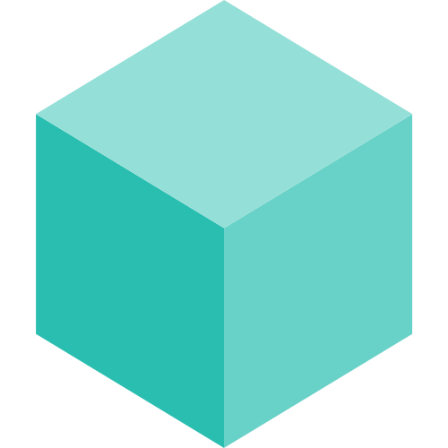

  

  <h1>Task</h1>

  

    Task is a task runner / build tool that aims to be simpler and easier to use than, for example, <a href="https://www.gnu.org/software/make/">GNU Make<a>.
  

  

    <a href="https://taskfile.dev/installation/">Installation</a> | <a href="https://taskfile.dev/usage/">Documentation</a> | <a href="https://twitter.com/taskfiledev">Twitter</a> | <a href="https://discord.gg/6TY36E39UK">Discord</a>
  

## Gold Sponsors

| [Appwrite][appwrite] |
| - |
| [][appwrite] |

[appwrite]: https://appwrite.io/?utm_source=task_github&utm_medium=social&utm_campaign=task_oss_fund
