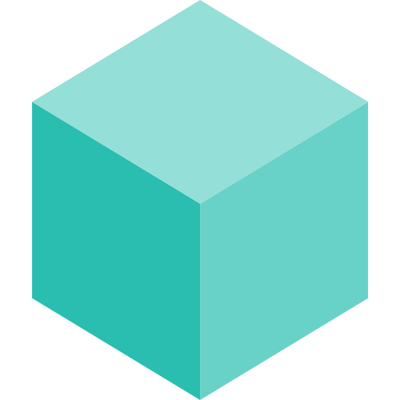

  

  <h1>Task</h1>

  

    Task is a task runner / build tool that aims to be simpler and easier to use than, for example, <a href="https://www.gnu.org/software/make/">GNU Make<a>.
  

  

    <a href="https://taskfile.dev/docs/installation">Installation</a> | <a href="https://taskfile.dev/docs/getting-started">Getting Started</a> | <a href="https://taskfile.dev/docs/guide">Docs</a> | <a href="https://twitter.com/taskfiledev">Twitter</a> | <a href="https://bsky.app/profile/taskfile.dev">Bluesky</a> | <a href="https://fosstodon.org/@task">Mastodon</a> | <a href="https://discord.gg/6TY36E39UK">Discord</a>
  

  <h1>Gold Sponsors</h1>

  <table>
    <tr>
      <td align="center" valign="middle">
        
      </td>
      <td align="center" valign="middle">
        
      </td>
    </tr>
  </table>

