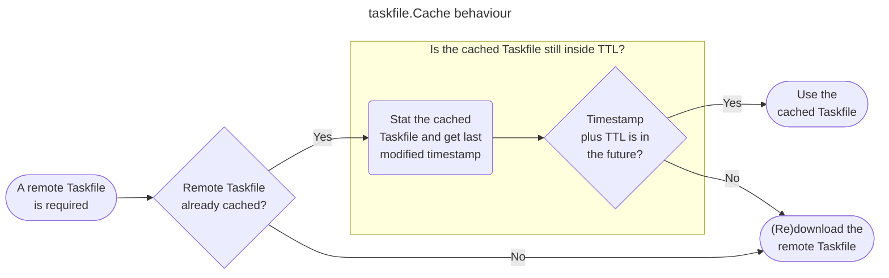

# The `taskfile` package

```mermaid
---
title: taskfile.Cache behaviour
---
flowchart LR
  %% Beginning state
    start([A remote Taskfile
      is required])

  %% Checks to decide
    cached{Remote Taskfile
      already cached?}

    subgraph checkTTL [Is the cached Taskfile still inside TTL?]
    %% Beginning state
      lastModified(Stat the cached
        Taskfile and get last
        modified timestamp)

    %% Check to decide
      timestampPlusTTL{Timestamp
        plus TTL is in
        the future?}

    %% Flowlines
      lastModified-->timestampPlusTTL
    end

  %% End states
    useCached([Use the
      cached Taskfile])
    download(["(Re)download the
      remote Taskfile"])

  %% Flowlines
    start-->cached
    cached-- Yes -->lastModified
    cached-- No -->download
    timestampPlusTTL-- Yes -->useCached
    timestampPlusTTL-- No -->download
```
