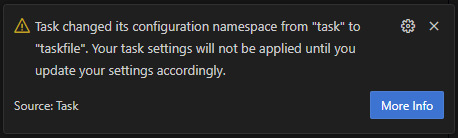
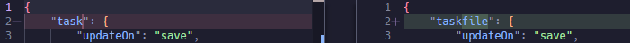

# Integrations

## Visual Studio Code Extension

Task has an
[official extension for Visual Studio Code](https://marketplace.visualstudio.com/items?itemName=task.vscode-task).
The code for this project can be found in
[our GitHub repository](https://github.com/go-task/vscode-task). To use this
extension, you must have Task v3.45.3+ installed on your system.

This extension provides the following features (and more):

- View tasks in the sidebar.
- Run tasks from the sidebar and command palette.
- Go to definition from the sidebar and command palette.
- Run last task command.
- Multi-root workspace support.
- Initialize a Taskfile in the current workspace.

To get autocompletion and validation for your Taskfile, see the
[Schema](#schema) section below.


### Configuration namespace change

In v1.0.0 of the extension, the configuration namespace was changed from `task`
to `taskfile` in order to fix
[an issue](https://github.com/go-task/vscode-task/issues/56).



If you receive a warning like the one above, you will need to update your
settings to use the new `taskfile` namespace instead:



## Schema

This was initially created by @KROSF in
[this Gist](https://gist.github.com/KROSF/c5435acf590acd632f71bb720f685895) and
is now officially maintained in
[this file](https://github.com/go-task/task/blob/main/website/src/public/schema.json)
and made available at https://taskfile.dev/schema.json. This schema can be used
to validate Taskfiles and provide autocompletion in many code editors:

### Visual Studio Code

To integrate the schema into VS Code, you need to install the
[YAML extension](https://marketplace.visualstudio.com/items?itemName=redhat.vscode-yaml)
by Red Hat. Any `Taskfile.yml` in your project should automatically be detected
and validation/autocompletion should work. If this doesn't work or you want to
manually configure it for files with a different name, you can add the following
to your `settings.json`:

```json
// settings.json
{
  "yaml.schemas": {
    "https://taskfile.dev/schema.json": [
      "**/Taskfile.yml",
      "./path/to/any/other/taskfile.yml"
    ]
  }
}
```

You can also configure the schema directly inside of a Taskfile by adding the
following comment to the top of the file:

```yaml
# yaml-language-server: $schema=https://taskfile.dev/schema.json
version: '3'
```

You can find more information on this in the
[YAML language server project](https://github.com/redhat-developer/yaml-language-server).

## AI/LLM Assistants

Task documentation is optimized for AI assistants like Claude Code, Cursor, and
other LLM-powered development tools through the
[VitePress LLMs plugin](https://github.com/okineadev/vitepress-plugin-llms).

This integration provides:

- Structured documentation in LLM-friendly formats
- Context-optimized content for AI assistants
- Automatic generation of `llms.txt` and `llms-full.txt` files
- Enhanced discoverability of Task features for AI tools

AI assistants can access Task documentation through:

- **[llms.txt](https://taskfile.dev/llms.txt)**: Lightweight overview of Task documentation
- **[llms-full.txt](https://taskfile.dev/llms-full.txt)**: Complete documentation with all content

These files are automatically generated and kept in sync with the documentation,
ensuring AI assistants always have access to the latest Task features and usage
patterns.

## pre-commit

Task has official support for [pre-commit](https://pre-commit.com/), a framework
for managing and maintaining multi-language pre-commit hooks. This allows you to
automatically run Task tasks as part of your Git workflow.

### Setup

Add the following to your `.pre-commit-config.yaml`:

```yaml
repos:
  - repo: https://github.com/go-task/task
    rev: v3.x.x # Replace with the desired Task version
    hooks:
      - id: task
        args: ['my-task']
```

The hook will install Task via `go install` and run the specified task. You can
use any `task` CLI arguments in the `args` field.

### Configuration

The `task` hook supports the following pre-commit options:

| Option           | Default | Description                                                 |
| ---------------- | ------- | ----------------------------------------------------------- |
| `args`  | `[]` | Arguments passed to `task` (e.g. task name, `--dir`, flags) |
| `files` | `''` | Only run the hook when these files change                   |

### Examples

<details>
<summary>Run a task unconditionally on every commit</summary>

```yaml
repos:
  - repo: https://github.com/go-task/task
    rev: v3.x.x
    hooks:
      - id: task
        args: ['lint']
```

</details>

<details>
<summary>Run a task only when certain files change</summary>

```yaml
repos:
  - repo: https://github.com/go-task/task
    rev: v3.x.x
    hooks:
      - id: task
        files: ^docs/
        args: ['generate-docs']
```

</details>

<details>
<summary>Run a task in a subdirectory</summary>

```yaml
repos:
  - repo: https://github.com/go-task/task
    rev: v3.x.x
    hooks:
      - id: task
        args: ['--dir', 'frontend', 'build']
```

</details>

<details>
<summary>Run multiple tasks with different file triggers</summary>

```yaml
repos:
  - repo: https://github.com/go-task/task
    rev: v3.x.x
    hooks:
      - id: task
        name: lint
        files: \.go$
        args: ['lint']
      - id: task
        name: generate
        files: \.proto$
        args: ['generate']
```

</details>

<details>
<summary>Run a lightweight task on commit and a heavier task on push</summary>

```yaml
repos:
  - repo: https://github.com/go-task/task
    rev: v3.x.x
    hooks:
      - id: task
        name: lint
        args: ['lint']
        stages: [pre-commit]
      - id: task
        name: test
        args: ['test']
        stages: [pre-push]
```

</details>

## Community Integrations

In addition to our official integrations, there is an amazing community of
developers who have created their own integrations for Task:

- [Sublime Text Plugin](https://packagecontrol.io/packages/Taskfile)
  [[source](https://github.com/biozz/sublime-taskfile)] by @biozz
- [IntelliJ Plugin](https://plugins.jetbrains.com/plugin/17058-taskfile)
  [[source](https://github.com/lechuckroh/task-intellij-plugin)] by @lechuckroh
- [mk](https://github.com/pycontribs/mk) command line tool recognizes Taskfiles
  natively.
- [fzf-make](https://github.com/kyu08/fzf-make) fuzzy finder with preview window
  for make, pnpm, yarn, just & task.

If you have made something that integrates with Task, please feel free to open a
PR to add it to this list.
